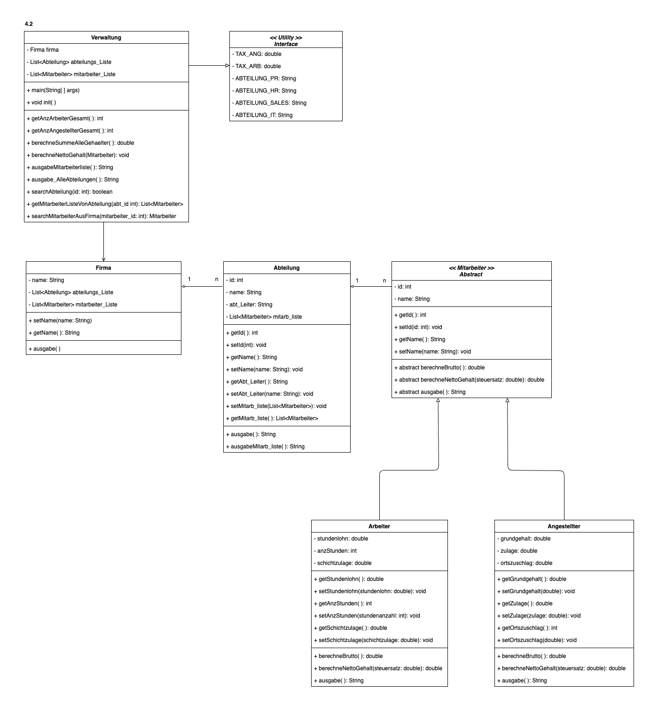

# Firma Version 4.2
Dieses Repo enthält die Java-Lösung zu Version 4.2 des Projekts "Firma".

Die Main-Datei ist `Verwaltung.java` allerdings befinden sich alle Tests in der Datei `VerwaltungTest.java` (insgesamt vierzehn JUnit-Tests).

## Klassendiagramm

Die Originaldateien des Klassendiagramms findet man hier: https://github.com/mbalabanov/ClassDiagramFirmaV4_1-4_4
